<!--
  ╔══════════════════════════════════════════════════════════════════╗
  ║  👇 ONLY CHANGE THIS ONE LINE AFTER DEPLOYING YOUR VERCEL APP   ║
  ║  Follow SETUP_GUIDE.md — takes 10 mins, fixes stats forever     ║
  ╚══════════════════════════════════════════════════════════════════╝
  
  Replace YOUR_STATS_URL below with your actual Vercel URL
  Example: https://github-readme-stats-hassan39z.vercel.app
-->

<div align="center">



<br/>

[](https://hassan-portfolio-zeta.vercel.app/)
[](https://linkedin.com/in/hassan39)
[](mailto:hassan.dev39@gmail.com)
[](https://github.com/HASSAN39z)

</div>

---


## `> whoami`

```yaml
name       : Muhammad Hassan
role       : Full-Stack MERN Developer
mobile     : React Native + Expo
ai         : LLM & AI Integration
focus      : Scalable UX-driven Apps
status     : Open to Opportunities ✅
```

<br clear="right"/>

---

## `> tech --list`

<div align="center">

**`[ FRONTEND ]`**


**`[ BACKEND & DATA ]`**


**`[ MOBILE ]`**


**`[ DEVOPS & TOOLS ]`**


</div>

---

## `> github --stats`

<div align="center">


</div>

<br/>

<div align="center">
  
</div>

<br/>

<div align="center">
  
</div>

---

## `> achievements --display`

<div align="center">



</div>

---

<div align="center">


</div>
